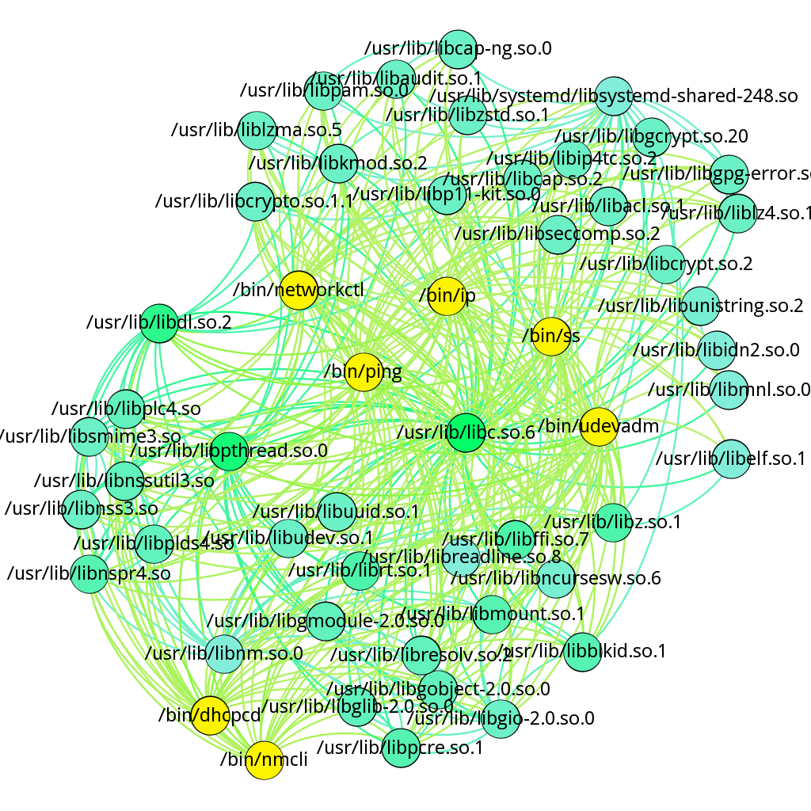
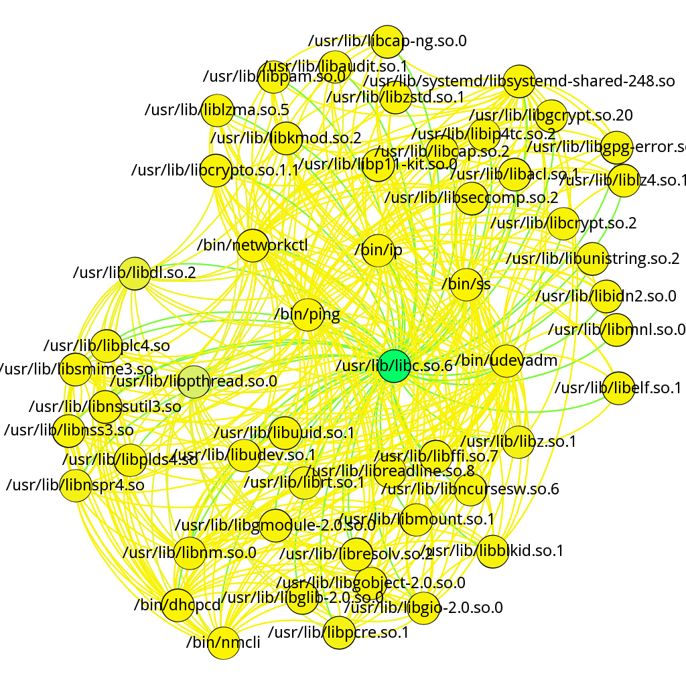
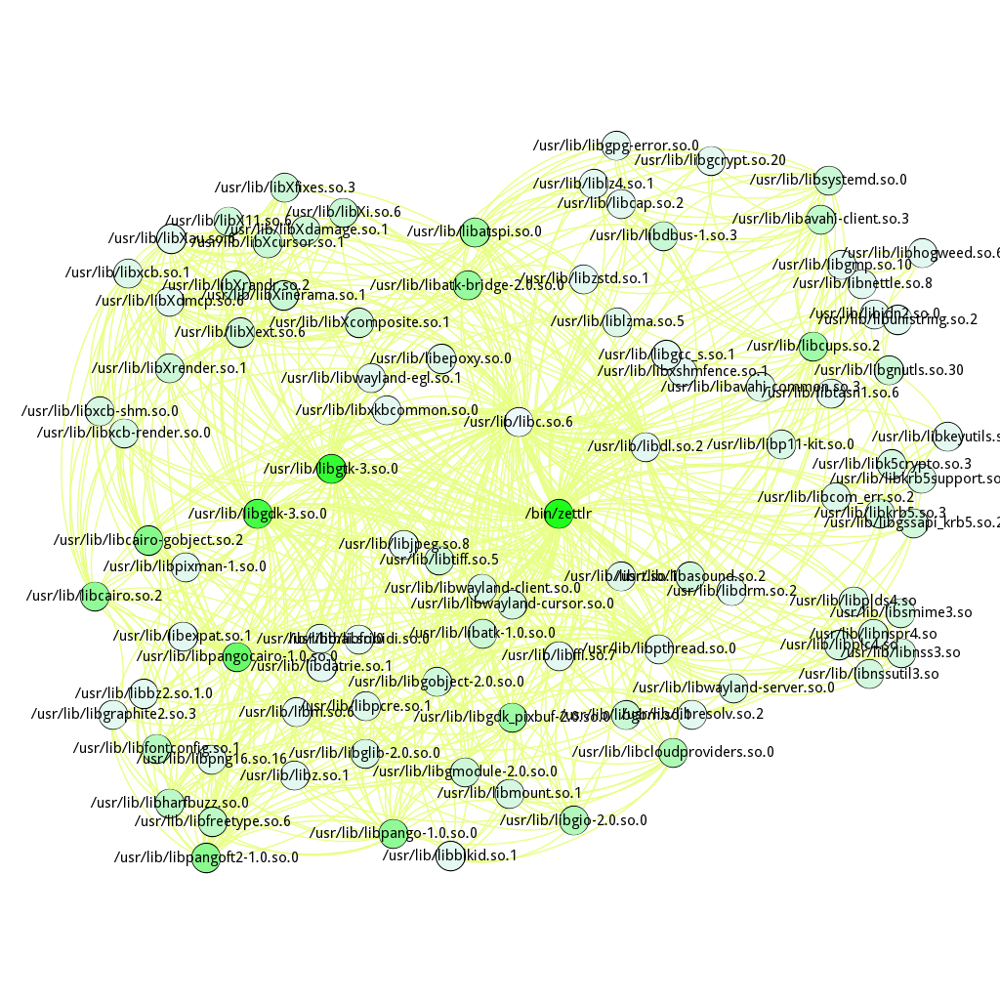

# Visualization and analysis of ELF files interconnections

* [Project description](#project-description)
* [Results](#results)
* [Files and folders description](#files-and-folders-description)

### Project description
My diploma project for analyzing Shared Objects of ELF format files and DLL/EXE of PE format files based on graphs.
In the project I've used the following metrics:
* PageRank -  metric for evaluating most "important" node. "Important" is defined as the node which gets the most imports or is connected to the most nodes with the biggest number of imports.
* HITS - metrics for evaluating "authority" and "hubness" of nodes. 
    - **"Authority"** stands for the number of **exports** divided by the sum of metric **"hubness"** of nearby nodes. 
    - **"Hubness"** stands for the number of **imports** divided by the sum of metric **"authority"** of nearby nodes. 

## Results
Folder **out/** contains final visualizations of graphs. Visualization was fine-tuned in program **Gephi**.
Files are named after metrics used for analysis. 

### Examples:
**out/net_auth.png | Metric: HITS, Authority**

* yellow - max value of the metric
* blue - middle value of the metric
* green - min value of the metric

**out/net_page.png | Metric: PageRank**

* yellow - max value of the metric
* blue - middle value of the metric
* green - min value of the metric

**out/zetshell_hubs.png | Metric: HITS, Hubness**

* green - max value of the metric
* white - min value of the metric

## Files and folders description

#### File ***ELF_Graph.ipynb*** analyzes and import results in GEXF format.

As objects for analysis were chosen program **"Zettlr"** based on Electron and **ArchLinux network module**, programs and services related and responsible for internet connection functioning. Programm "Zettlr" was chosen due to huge number of SO imports, netmodule - due to the importance of module to the system.

File contains:
* Imports and comments listing of all /bin ELF files
* Analysis of "Zettlr" connections, intermediate images, import to GEXF
* Analysis of network module in ArchLinux, intermediate images, import to GEXF

Folders **[PageRank-HITS-SimRank](https://github.com/chonyy/PageRank-HITS-SimRank)**, **src/** are imported from library necessary for graph analyzing. I'm very grateful ***[Chonyy](https://chonyy.medium.com/)*** for implementig these metrics.

#### Other

Folder **research/** contains my temporary files used during my experiments to understand library functions.

Folder **bib/** contains all the surveys I've used in the diploma literature list.

File *research/PE_proccessor.ipynb* was my first attempt to get an understanding of interfile hierarchy. However, DOT GDL was used to build graph visualization, which was hard to read due to the clustering of multiple files at the root of the graph.
